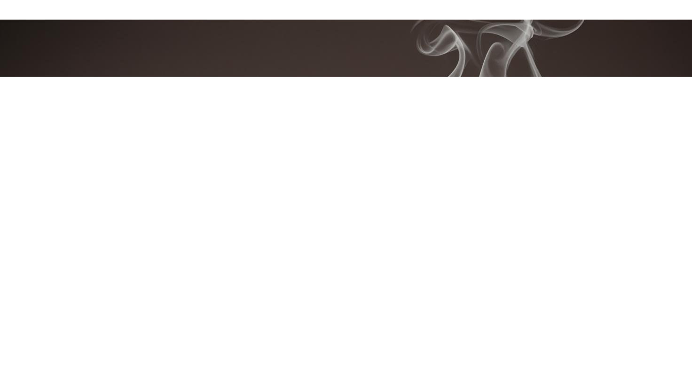

# Caffiora Coffee Shop Website

Welcome to **Caffiora** — a modern, responsive coffee shop website built with HTML, CSS, and JavaScript. This project is designed to showcase a coffee shop's menu, products, reviews, contact information, and blog in a visually appealing and user-friendly way.


---

## 🚀 Features

- **Responsive Design**: Looks great on desktop, tablet, and mobile devices.
- **Modern UI**: Clean, elegant, and coffee-inspired color palette.
- **Interactive Navigation**: Hamburger menu, search, and cart toggles.
- **Menu & Products**: Grid layouts for food and beverage items with images and prices.
- **Customer Reviews**: Swiper.js-powered slider for testimonials.
- **Contact Form**: Styled form with validation-ready fields and embedded Google Map.
- **Blog Section**: Highlighted articles with images and titles.
- **Font Awesome Icons**: For social links and UI elements.

---

## 📂 Project Structure

```
CAFFIORA/
│
├── index.html         # Main HTML file
├── style.css          # Custom styles
├── script.js          # JavaScript for interactivity
├── Images/            # All images and assets
│   └── Menu/          # Menu item images
└── ...
```

---

## 🛠️ Getting Started

1. **Clone the repository**
   ```sh
   git clone https://github.com/your-username/CAFFIORA.git
   cd CAFFIORA
   ```
2. **Open `index.html` in your browser**
   - No build step required. All assets are local or CDN-hosted.

---

## 📸 Screenshots

| Home Page | Menu Section | Contact Form |
|-----------|--------------|--------------|
|  |  |  |

---

## ✨ Customization
- **Images**: Replace images in the `Images/` folder to match your brand.
- **Colors & Fonts**: Edit `style.css` for custom color schemes or typography.
- **Content**: Update `index.html` for menu, products, reviews, and blog posts.

---

## 📦 Dependencies
- [Font Awesome 6](https://fontawesome.com/)
- [Swiper.js](https://swiperjs.com/)
- [Google Fonts: Roboto](https://fonts.google.com/specimen/Roboto)

---

## 🤝 Contributing
Pull requests are welcome! For major changes, please open an issue first to discuss what you would like to change.

---

## 📄 License
This project is open source and available under the [MIT License](LICENSE).

---

## 📬 Contact
- **Email**: info@caffiorashop.com
- **Website**: [www.caffioraweb.com](http://www.caffioraweb.com)
- **Instagram**: [@caffiora](#)

---

> Crafted with ☕ by the Caffiora Team
